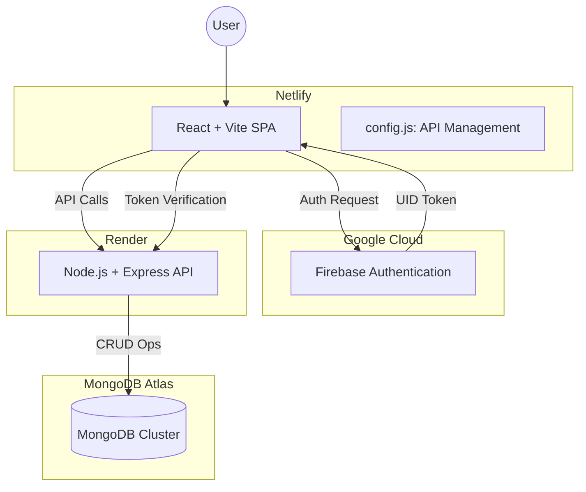

# Chromo-Web: Application Flow & Architecture

Welcome to **Chromo-Web**, a premium arcade-style paint eCommerce platform. This document outlines the end-to-end journey of a user and the underlying technology that powers the experience.

## 1. High-Level Architecture

The application follows a modern **Decoupled Architecture**:

---

## 2. User Journey (Flow)

### Phase 1: Authentication & Onboarding
1.  **Landing Page (`/`)**: User arrives to view featured "vibrant colors".
2.  **Register (`/register`)**: User creates an account. 
    - **Step A**: Firebase Auth creates the credential.
    - **Step B**: `Register.jsx` sends a `POST` request to the Backend (`/api/users`) to sync the UID with extra profile info (address, phone) in MongoDB.
3.  **Login (`/login`)**: Existing users sign in via Firebase.

### Phase 2: Browsing & Discovery
1.  **Search & Filters**: Users search for specific brands or filter by finish (Matte, Enamel) on the Homepage.
2.  **Product Detail (`/product/:id`)**: User views rich details, selects a weight/variant (e.g., 1L, 4L, 20L), and sees live price calculations.

### Phase 3: Cart & Shipping
1.  **Add to Cart**: Items are sent to the Backend (`/api/cart`) and persisted in MongoDB, allowing for a persistent cart across devices.
2.  **Cart Page (`/cart`)**: User reviews items, adjusts quantities, and manages shipping addresses.
    - **Address Manager**: Users can add multiple addresses (Home, Office).

### Phase 4: Checkout & Fulfillment
1.  **Payment Selection (`/checkout/payment`)**: User selects a payment method (e.g., Pay on Delivery).
2.  **Order Review (`/checkout/review`)**: Final summary of items, shipping address, and total amount.
3.  **Place Order**: `POST` to `/api/orders`. The backend clears the cart and creates a permanent order record.
4.  **Order Success**: User is redirected to **My Orders (`/orders`)** to view their purchase history.

---

## 3. Technology Stack

| Layer | Technology | Purpose |
| :--- | :--- | :--- |
| **Frontend UI** | **React 19** | Dynamic, component-based user interface. |
| **Styling** | **Vanilla CSS + Lucide Icons** | Premium neon/dark-mode aesthetics. |
| **State** | **React Context (Auth & Cart)** | Global state management for user and shopping data. |
| **Authentication** | **Firebase Auth** | Secure OAuth and Email/Password login. |
| **Backend API** | **Node.js + Express** | RESTful API for business logic and DB access. |
| **Database** | **MongoDB Atlas** | NoSQL document storage for users, products, and orders. |
| **Deployment** | **Netlify (FE) & Render (BE)** | Scalable cloud hosting. |

---

## 4. Key Security & Connectivity Features
- **Centralized API Config**: Uses `VITE_API_URL` to seamlessly switch between `localhost:5000` and the Render backend.
- **SSL Resilience**: Backend connection includes SSL bypass for local development across various network environments.
- **SPA Redirection**: Netlify `_redirects` ensures that refreshing the page on routes like `/orders` doesn't cause a 404 error.
